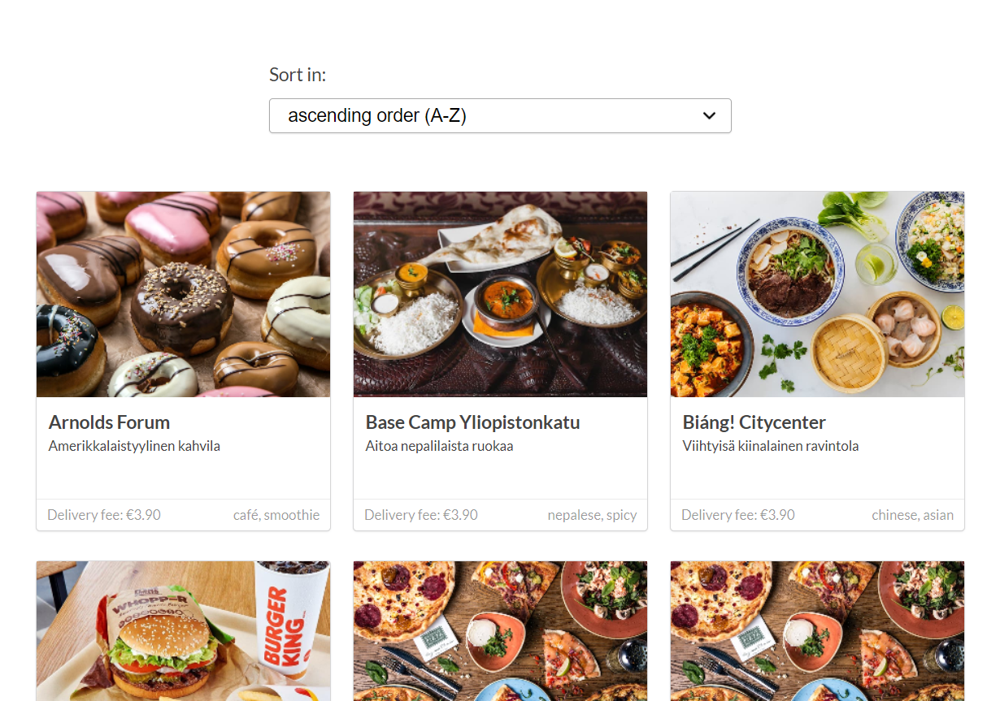
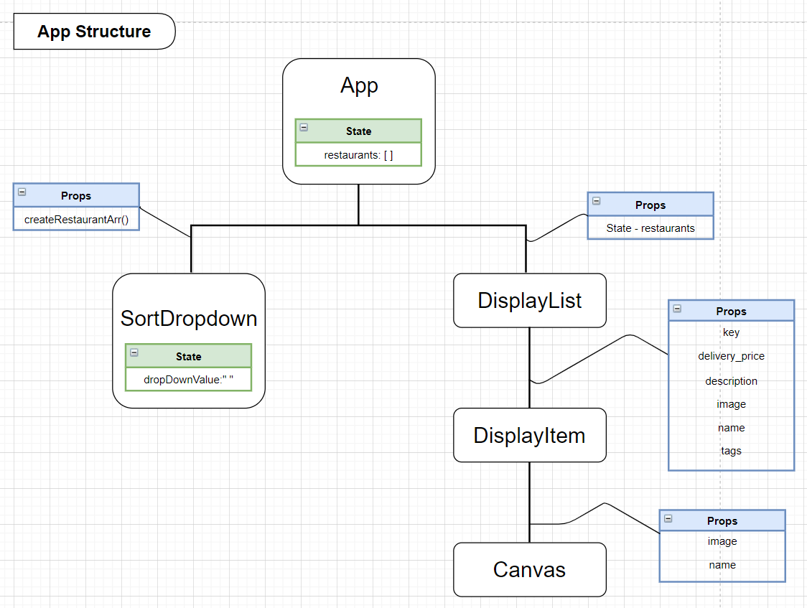

# Restaurants in Helsinki

This project is built with Javascript React. The web page renders and sorts 50 restaurants in Helsinki in ascending and descending alphabetical order with restaurants' name.



## 1. Demo

Click [here.](https://chaeahpark.github.io/restaurant-helsinki/)

## 2. App structure



## 3. Getting started

Step #1) Download the file.

Step #2) Extract all from the file.

Step #3) Access to the 'restaurant-helsinki' file.

```
> cd restaurant-helsinki
```

Step #4) In the restaurant-helsinki folder, check 'package.json' file.

```
> touch package.json
```

And ensure scripts are noted like below.

```
"scripts": {
    "predeploy": "npm run build",
    "deploy": "gh-pages -d build",
    "start": "react-scripts start",
    "build": "react-scripts build",
    "test": "react-scripts test",
    "eject": "react-scripts eject"
  },

```

Step #5) Delete the 'node_modules' folder and any 'lock' files such as 'yarn.lock' or 'package-lock.json' if present.

Step #6) Install necesary dependencies from npm

```
> npm install
```

Step #7) Check your localhost:3000 is running. If it is not, run the app with the following command line.

```
> npm start
```

If localhost:3000 is running, set another port to run the app. For example,

```
> PORT=3001 npm start
```

You can change 3001 to any port number that you'd like to run on.

## 4. Dependencies

- @testing-library/jest-dom: v. 4.2.4
- @testing-library/react: v. 9.4.0
- @testing-library/user-event: v.7.2.1
- react: v.16.12.0
- react-dom: v.16.12.0
- react-scripts: v.3.3.1

## Questions?

parkchaeah331@gmail.com
